# Mini-react-projects

A collection of small React projects and experiments intended for learning, demos, and quick prototypes.

## Quiz App

The Goals app is a simple Expo React Native demo that lets you add and remove short text goals stored in local component state. Tapping "Add New Goal" opens a modal to submit a new item, which is appended to list and rendered with a FlatList. Deletion of goal items is also supported. It's primarily for learning state management, list rendering, and modal input patterns.

<table>
  <tr>
    <td>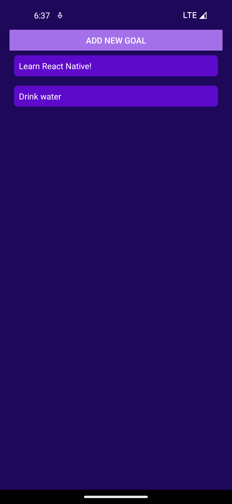</td>
    <td>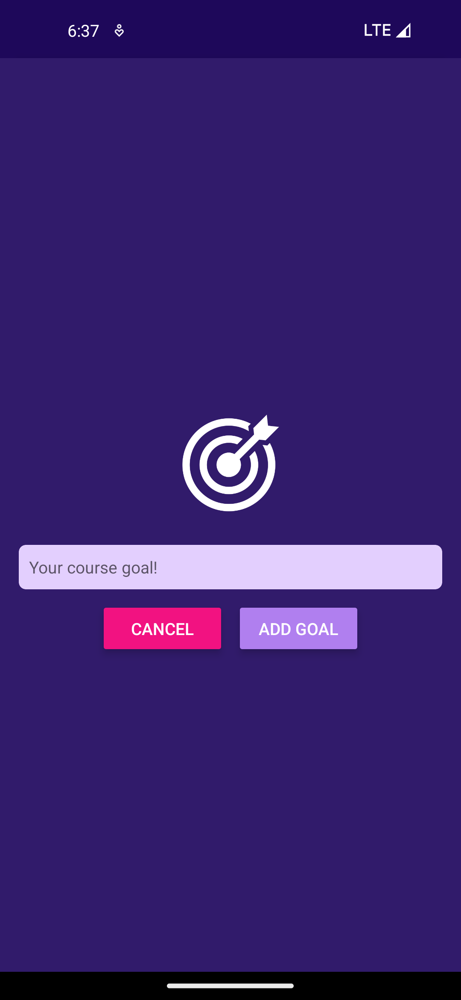</td>
    <td>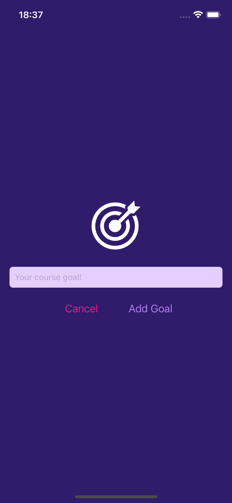</td>
  </tr>
</table>

## Meals App

The Meals app is an Expo React Native demo that presents a browsable recipe catalog organized by categories. It uses a Drawer and Stack navigation which enable users to switch between category lists, a meals overview, meal detail pages, and a Favorites screen. Favorites are managed with a small FavoritesContext so users can mark/unmark meals and view them in the Favorites screen. The app demonstrates data-driven screens, context-based state, and navigation patterns.

<table>
  <tr>
    <td>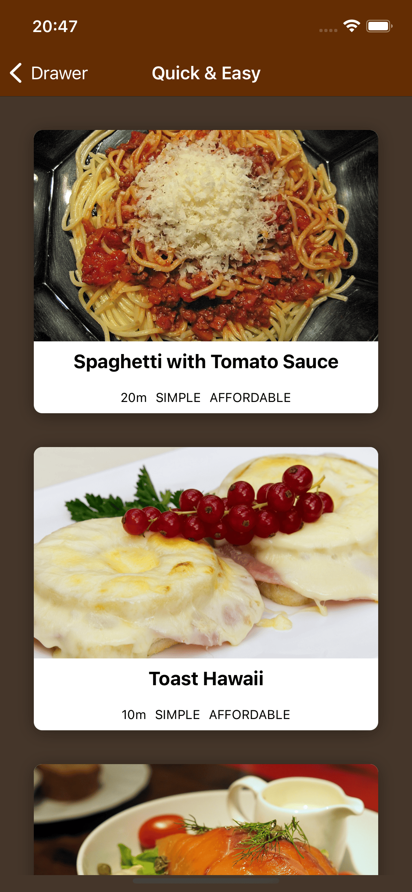</td>
    <td>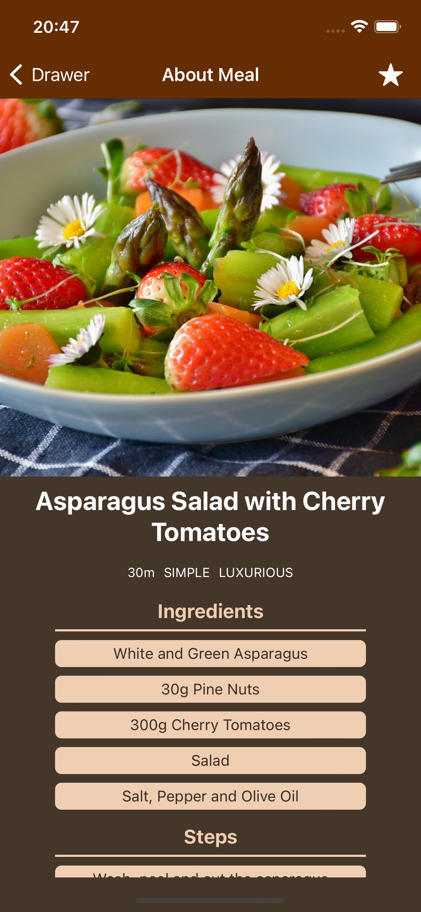</td>
    <td>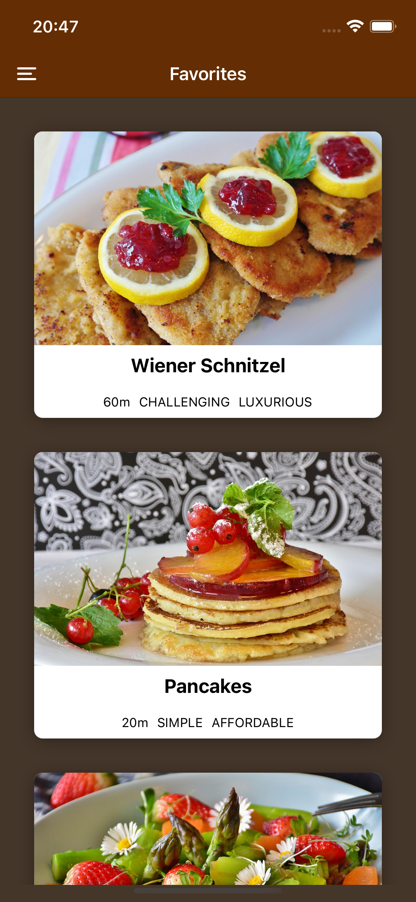</td>
  </tr>
</table>

## Guessing Game

The Guessing Game is an Expo React Native demo where the user picks a number and the app—the opponent—attempts to guess it. The opponent makes random guesses within narrowing bounds and the user gives higher or lower single as feedback. Guesses are recorded in a log and the game ends when the opponent matches the chosen number. The app demonstrates responsive layouts, custom UI components, font loading, and simple state/effect hooks to manage rounds and flow.

<table>
  <tr>
    <td>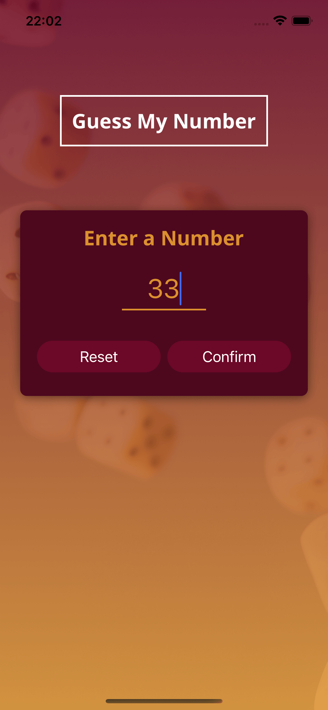</td>
    <td>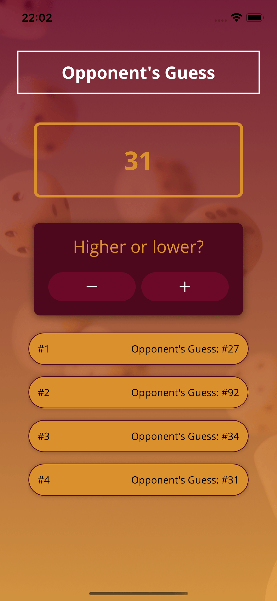</td>
    <td>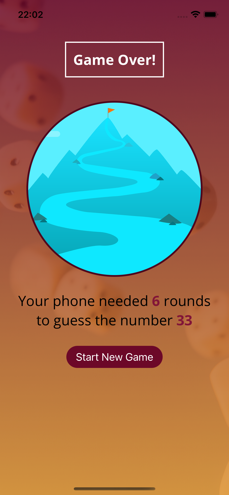</td>
  </tr>
</table>

## Expense Tracker

The Expense Tracker is an Expo React Native app for creating, editing, and deleting expenses with persistence to a Firebase Realtime Database. It uses a Context and useReducer pattern for state management. A bottom-tabs and a stack navigation are used to navigate between a number of screens; RecentExpenses, AllExpenses, and ManageExpenses. ManageExpenses implements the CRUD flows and shows LoadingOverlay/ErrorOverlay during network operations.

<table>
  <tr>
    <td>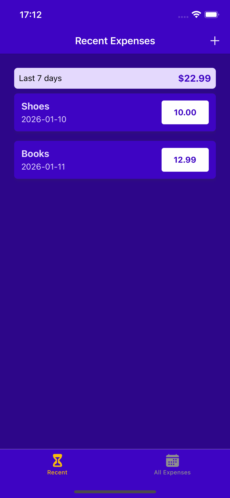</td>
    <td>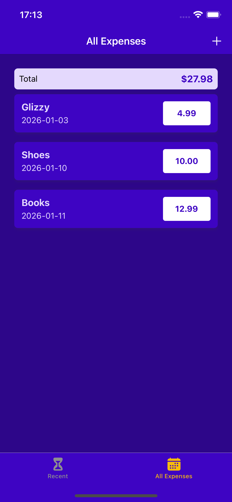</td>
    <td>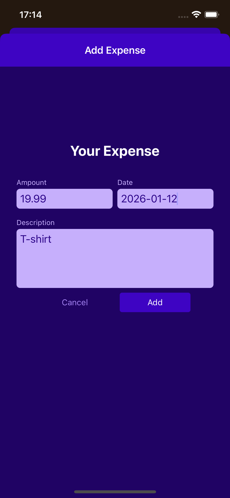</td>
  </tr>
</table>
